<!-- Copy and paste the converted output. -->

<!-----

You have some errors, warnings, or alerts. If you are using reckless mode, turn it off to see inline alerts.
* ERRORs: 0
* WARNINGs: 1
* ALERTS: 40

Conversion time: 13.468 seconds.

Using this Markdown file:

1. Paste this output into your source file.
2. See the notes and action items below regarding this conversion run.
3. Check the rendered output (headings, lists, code blocks, tables) for proper
   formatting and use a linkchecker before you publish this page.

Conversion notes:

* Docs to Markdown version 1.0β34
* Sat May 13 2023 03:44:23 GMT-0700 (PDT)
* Source doc: MechAssyGuide

WARNING:
Inline drawings not supported: look for ">>>>>  gd2md-html alert:  inline drawings..." in output.

* This document has images: check for >>>>>  gd2md-html alert:  inline image link in generated source and store images to your server. NOTE: Images in exported zip file from Google Docs may not appear in  the same order as they do in your doc. Please check the images!

----->

>>>>>  gd2md-html alert:  ERRORs: 0; WARNINGs: 1; ALERTS: 40.

<ul style="color: red; font-weight: bold"><li>See top comment block for details on ERRORs and WARNINGs. <li>In the converted Markdown or HTML, search for inline alerts that start with >>>>>  gd2md-html alert:  for specific instances that need correction.</ul>

Links to alert messages:
<a href="#gdcalert1">alert1</a>
<a href="#gdcalert2">alert2</a>
<a href="#gdcalert3">alert3</a>
<a href="#gdcalert4">alert4</a>
<a href="#gdcalert5">alert5</a>
<a href="#gdcalert6">alert6</a>
<a href="#gdcalert7">alert7</a>
<a href="#gdcalert8">alert8</a>
<a href="#gdcalert9">alert9</a>
<a href="#gdcalert10">alert10</a>
<a href="#gdcalert11">alert11</a>
<a href="#gdcalert12">alert12</a>
<a href="#gdcalert13">alert13</a>
<a href="#gdcalert14">alert14</a>
<a href="#gdcalert15">alert15</a>
<a href="#gdcalert16">alert16</a>
<a href="#gdcalert17">alert17</a>
<a href="#gdcalert18">alert18</a>
<a href="#gdcalert19">alert19</a>
<a href="#gdcalert20">alert20</a>
<a href="#gdcalert21">alert21</a>
<a href="#gdcalert22">alert22</a>
<a href="#gdcalert23">alert23</a>
<a href="#gdcalert24">alert24</a>
<a href="#gdcalert25">alert25</a>
<a href="#gdcalert26">alert26</a>
<a href="#gdcalert27">alert27</a>
<a href="#gdcalert28">alert28</a>
<a href="#gdcalert29">alert29</a>
<a href="#gdcalert30">alert30</a>
<a href="#gdcalert31">alert31</a>
<a href="#gdcalert32">alert32</a>
<a href="#gdcalert33">alert33</a>
<a href="#gdcalert34">alert34</a>
<a href="#gdcalert35">alert35</a>
<a href="#gdcalert36">alert36</a>
<a href="#gdcalert37">alert37</a>
<a href="#gdcalert38">alert38</a>
<a href="#gdcalert39">alert39</a>
<a href="#gdcalert40">alert40</a>

>>>>> PLEASE check and correct alert issues and delete this message and the inline alerts.

**Clear Gauntlets Mechanical Assembly Guide**

This guide details the full process of assembling the mechanical system for ClearGauntlets.  This process will require all the 3D printed components, all the potentiometers, and the badge reels.

Start assembly at the finger module level.  

>>>>>  gd2md-html alert: inline image link here (to images/image1.jpg). Store image on your image server and adjust path/filename/extension if necessary.  (<a href="#">Back to top</a>)(<a href="#gdcalert2">Next alert</a>) >>>>> 

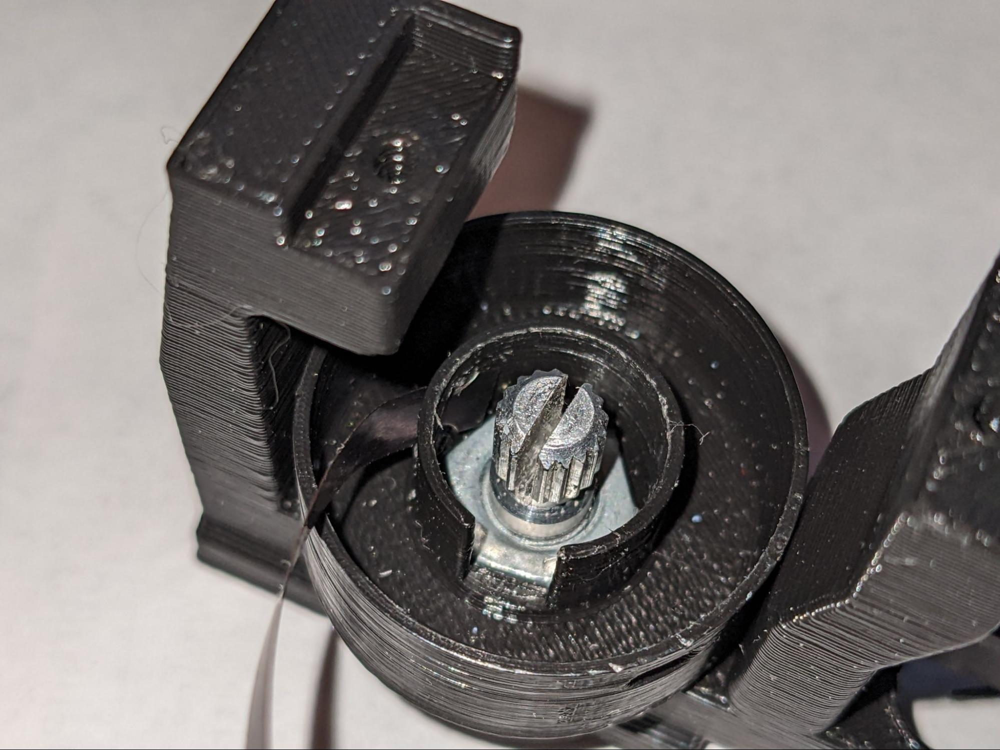

Insert the first potentiometer into the center slot.  Put the nut in the spool 1 part.  It should be a tight fit.

>>>>>  gd2md-html alert: inline image link here (to images/image2.jpg). Store image on your image server and adjust path/filename/extension if necessary.  (<a href="#">Back to top</a>)(<a href="#gdcalert3">Next alert</a>) >>>>> 

Screw the spool 1 down onto the potentiometer.  We need the two holes to be aligned on either side of the front post.  Most often, they won’t be aligned initially.  At this point, take note of which way part of the post is facing the front of the module.

>>>>>  gd2md-html alert: inline drawings not supported directly from Docs. You may want to copy the inline drawing to a standalone drawing and export by reference. See <a href="https://github.com/evbacher/gd2md-html/wiki/Google-Drawings-by-reference">Google Drawings by reference</a> for details. The img URL below is a placeholder.  (<a href="#">Back to top</a>)(<a href="#gdcalert4">Next alert</a>) >>>>> 

Use a sharpie to mark the corner of the hex nut which pointed to the front of the module

>>>>>  gd2md-html alert: inline image link here (to images/image3.jpg). Store image on your image server and adjust path/filename/extension if necessary.  (<a href="#">Back to top</a>)(<a href="#gdcalert5">Next alert</a>) >>>>> 

Remove the nut and reinster with the marked corner now oriented in between the two holes

>>>>>  gd2md-html alert: inline image link here (to images/image4.jpg). Store image on your image server and adjust path/filename/extension if necessary.  (<a href="#">Back to top</a>)(<a href="#gdcalert6">Next alert</a>) >>>>> 

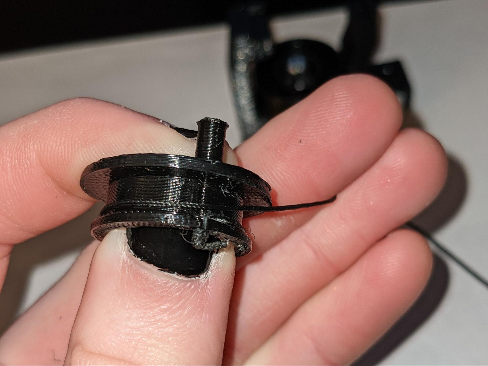

Screw the spool 1 back onto the module base

>>>>>  gd2md-html alert: inline image link here (to images/image5.jpg). Store image on your image server and adjust path/filename/extension if necessary.  (<a href="#">Back to top</a>)(<a href="#gdcalert7">Next alert</a>) >>>>> 

Grab the spool 2 part and a badge reel

>>>>>  gd2md-html alert: inline image link here (to images/image6.jpg). Store image on your image server and adjust path/filename/extension if necessary.  (<a href="#">Back to top</a>)(<a href="#gdcalert8">Next alert</a>) >>>>> 

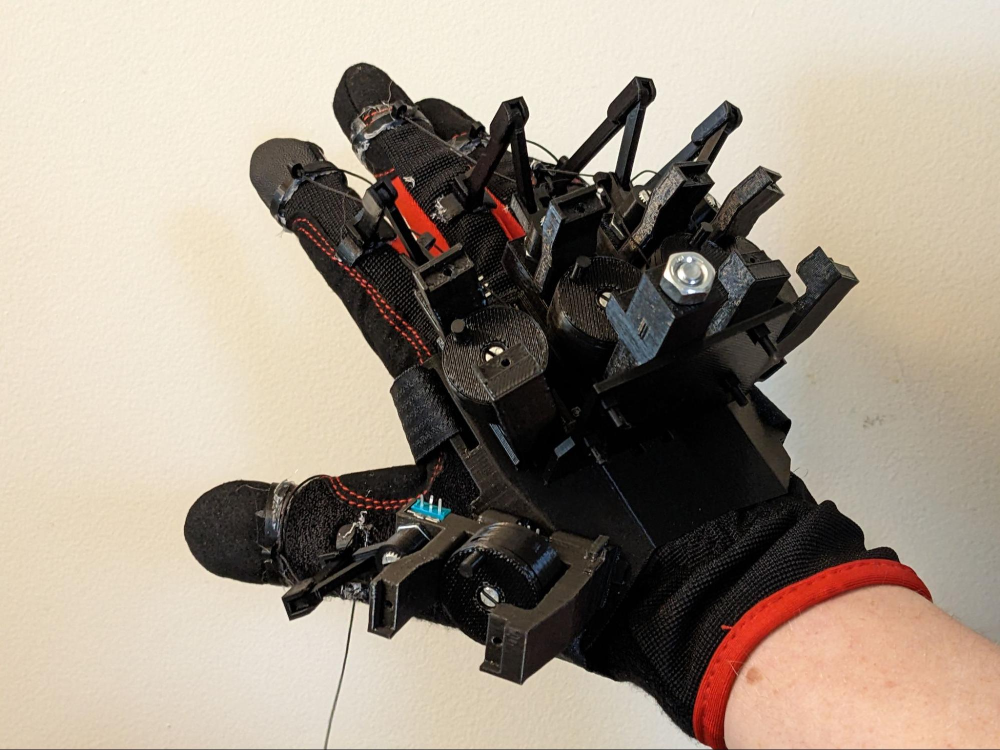

Cut the end of the badge reel string off

>>>>>  gd2md-html alert: inline image link here (to images/image7.jpg). Store image on your image server and adjust path/filename/extension if necessary.  (<a href="#">Back to top</a>)(<a href="#gdcalert9">Next alert</a>) >>>>> 

Use a pair of pliers or wire cutters to break open the badge reel, crushing the opening worked well on my badge reels

>>>>>  gd2md-html alert: inline image link here (to images/image8.jpg). Store image on your image server and adjust path/filename/extension if necessary.  (<a href="#">Back to top</a>)(<a href="#gdcalert10">Next alert</a>) >>>>> 

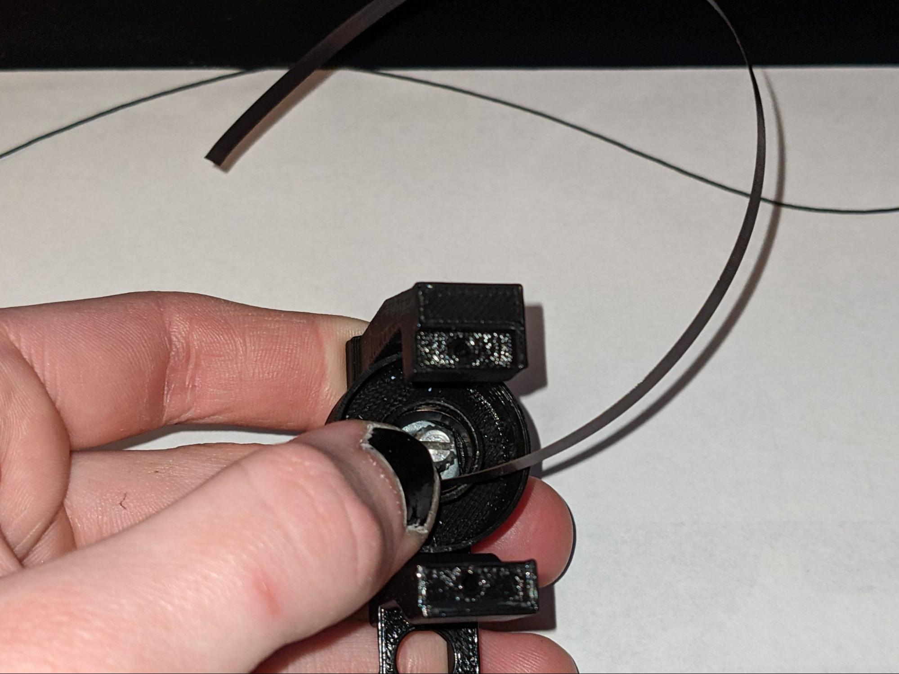

Extract the spring and the string from the badge reel.  You can throw the rest out.

>>>>>  gd2md-html alert: inline image link here (to images/image9.jpg). Store image on your image server and adjust path/filename/extension if necessary.  (<a href="#">Back to top</a>)(<a href="#gdcalert11">Next alert</a>) >>>>> 

Cut spring to a little under 10 inches, no need to be precise

>>>>>  gd2md-html alert: inline image link here (to images/image10.jpg). Store image on your image server and adjust path/filename/extension if necessary.  (<a href="#">Back to top</a>)(<a href="#gdcalert12">Next alert</a>) >>>>> 

Put a little bend in the cut end, it should only be maybe 2-3mm long, this will hold it in the potentiometer slot without slipping out.

>>>>>  gd2md-html alert: inline image link here (to images/image11.jpg). Store image on your image server and adjust path/filename/extension if necessary.  (<a href="#">Back to top</a>)(<a href="#gdcalert13">Next alert</a>) >>>>> 

Before winding the spring make sure the potentiometer is turned fully in one direction.

This should be clockwise if the module you are making is going to have the string coming out on the right side of the module. It will be counterclockwise if the string comes out on the left side.  This guide is showing a module where the string comes out to the right, iIf you are assembling a module where the string comes out on the left side, the direction of all winding in this guide should be reversed.

The modules where the string will come out to the right include Right Hand (RH) pointer, and middle, and LH ring, pinky, and thumb.

The modules where the string will come out to the left include RH ring, pinky, and thumb, and LH pointer and middle.

Starting with the flanged end, insert it through the sqaure hole on the left, you’ll need to come in at an angle.  You want the little divet to be passing through the square hole, the short end inside the inner area, and the rest of the spring coming out.

>>>>>  gd2md-html alert: inline image link here (to images/image12.jpg). Store image on your image server and adjust path/filename/extension if necessary.  (<a href="#">Back to top</a>)(<a href="#gdcalert14">Next alert</a>) >>>>> 

>>>>>  gd2md-html alert: inline image link here (to images/image13.jpg). Store image on your image server and adjust path/filename/extension if necessary.  (<a href="#">Back to top</a>)(<a href="#gdcalert15">Next alert</a>) >>>>> 

Start winding the spring counterclockwise, you’ll move it to the inner area right away, this motion should cause the flanged end to be pushed against the side wall as shown here.  As you are winding, you’ll also be guiding it down in line with the flanged end.  You’ll want to be holding it down with one thumb, while you use the other hand to move the free end.

>>>>>  gd2md-html alert: inline image link here (to images/image14.jpg). Store image on your image server and adjust path/filename/extension if necessary.  (<a href="#">Back to top</a>)(<a href="#gdcalert16">Next alert</a>) >>>>> 

The next three images show how I hold down the spooled spring, guide the free end around, and switch thumbs as I continue to guide in the free end of the spring.  Once you get the rhythm of it, it isn’t too difficult.

>>>>>  gd2md-html alert: inline image link here (to images/image15.jpg). Store image on your image server and adjust path/filename/extension if necessary.  (<a href="#">Back to top</a>)(<a href="#gdcalert17">Next alert</a>) >>>>> 

>>>>>  gd2md-html alert: inline image link here (to images/image16.jpg). Store image on your image server and adjust path/filename/extension if necessary.  (<a href="#">Back to top</a>)(<a href="#gdcalert18">Next alert</a>) >>>>> 

>>>>>  gd2md-html alert: inline image link here (to images/image17.jpg). Store image on your image server and adjust path/filename/extension if necessary.  (<a href="#">Back to top</a>)(<a href="#gdcalert19">Next alert</a>) >>>>> 

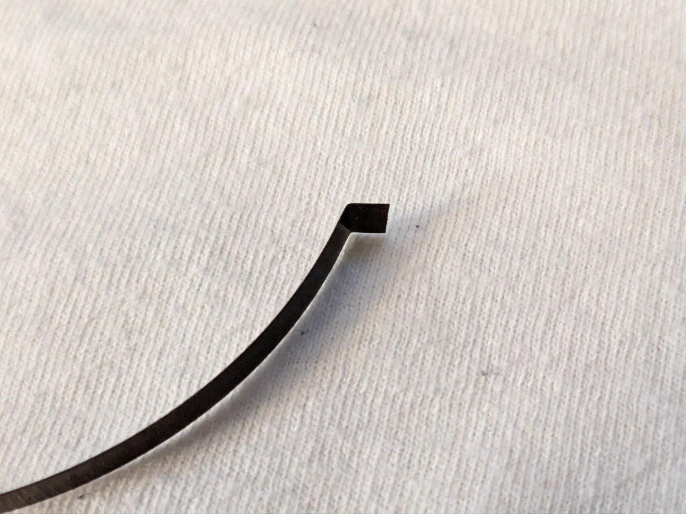

Once you reach the end of the spring, use a pair of needle nose pliers to grab the very end before the bend, curve it around a little more and place it in the slot of the potentiometer.  The spring might need to stretch a little bit in order to reach the slot, that’s okay and it will put a little tension on the potentiometer in it’s resting position, which is good.

>>>>>  gd2md-html alert: inline image link here (to images/image18.jpg). Store image on your image server and adjust path/filename/extension if necessary.  (<a href="#">Back to top</a>)(<a href="#gdcalert20">Next alert</a>) >>>>> 

It should look like this.

>>>>>  gd2md-html alert: inline image link here (to images/image19.jpg). Store image on your image server and adjust path/filename/extension if necessary.  (<a href="#">Back to top</a>)(<a href="#gdcalert21">Next alert</a>) >>>>> 

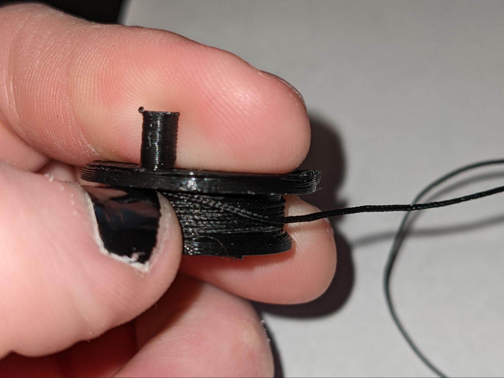

Use your pliers to push the spring down into place if needed.  We want it to be nice, neat, and all in line with itself, not coming up and down at different spots.

>>>>>  gd2md-html alert: inline image link here (to images/image20.jpg). Store image on your image server and adjust path/filename/extension if necessary.  (<a href="#">Back to top</a>)(<a href="#gdcalert22">Next alert</a>) >>>>> 

Thread the string though the hole in the upper spool.

>>>>>  gd2md-html alert: inline image link here (to images/image21.jpg). Store image on your image server and adjust path/filename/extension if necessary.  (<a href="#">Back to top</a>)(<a href="#gdcalert23">Next alert</a>) >>>>> 

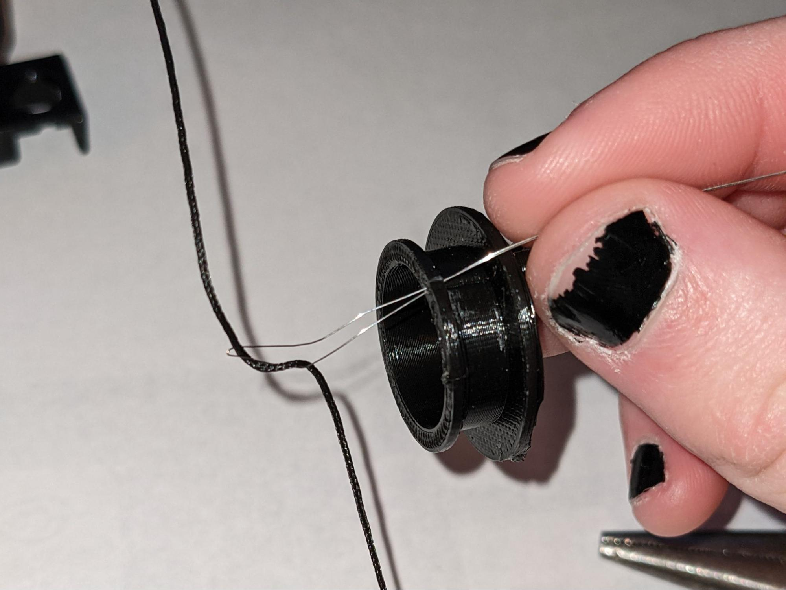

Start winding to the right (clockwise if you look from below, counterclockwise if you look from above). Try to wind it fairly tight.

>>>>>  gd2md-html alert: inline image link here (to images/image22.jpg). Store image on your image server and adjust path/filename/extension if necessary.  (<a href="#">Back to top</a>)(<a href="#gdcalert24">Next alert</a>) >>>>> 

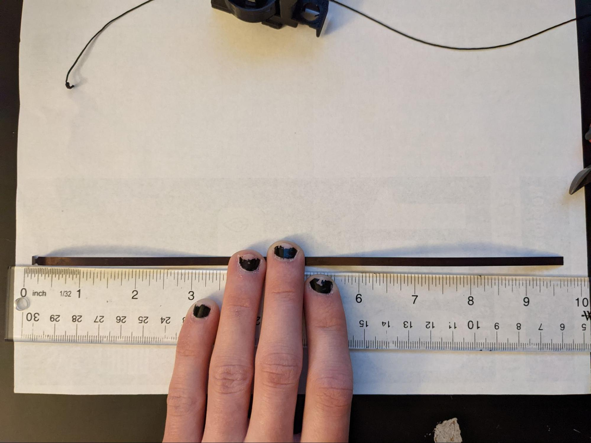

>>>>>  gd2md-html alert: inline image link here (to images/image23.jpg). Store image on your image server and adjust path/filename/extension if necessary.  (<a href="#">Back to top</a>)(<a href="#gdcalert25">Next alert</a>) >>>>> 

I like to just wind up until I can’t wind without stacking it on itself (usually 5 or so winds).  This will keep it flat against the spool.

>>>>>  gd2md-html alert: inline image link here (to images/image24.jpg). Store image on your image server and adjust path/filename/extension if necessary.  (<a href="#">Back to top</a>)(<a href="#gdcalert26">Next alert</a>) >>>>> 

Thread the string though the hole in the lower spool.

>>>>>  gd2md-html alert: inline image link here (to images/image25.jpg). Store image on your image server and adjust path/filename/extension if necessary.  (<a href="#">Back to top</a>)(<a href="#gdcalert27">Next alert</a>) >>>>> 

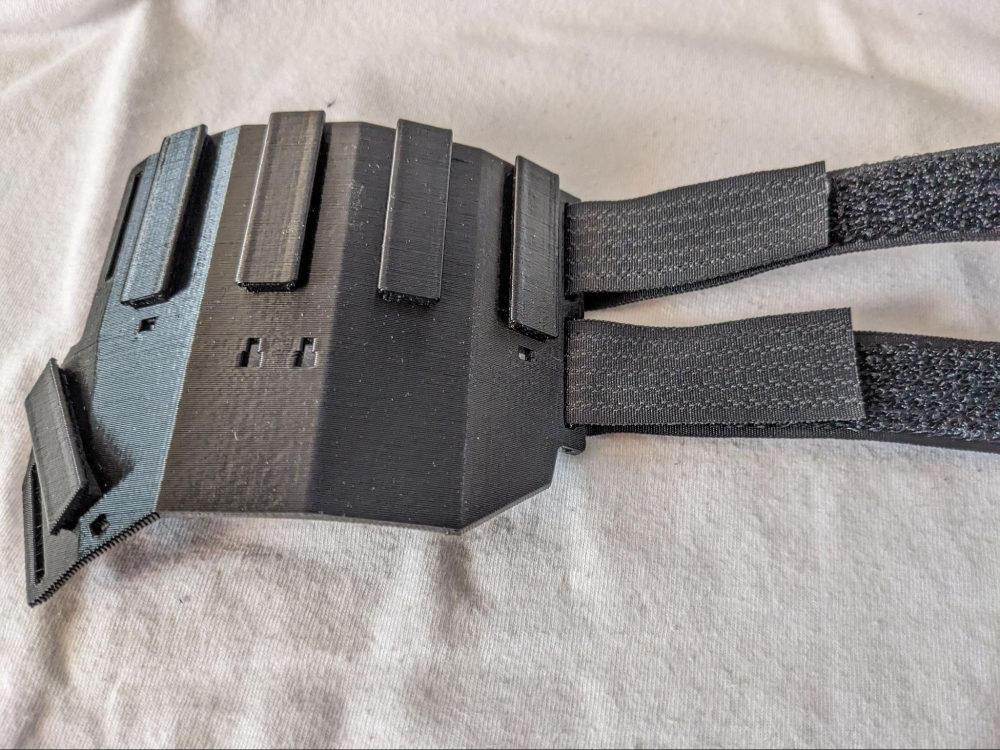

Bring the upper spool down into place, while keeping some tension on the end of the string.  Just shoving it in will cause the string to get all fucked up in there.

>>>>>  gd2md-html alert: inline image link here (to images/image26.jpg). Store image on your image server and adjust path/filename/extension if necessary.  (<a href="#">Back to top</a>)(<a href="#gdcalert28">Next alert</a>) >>>>> 

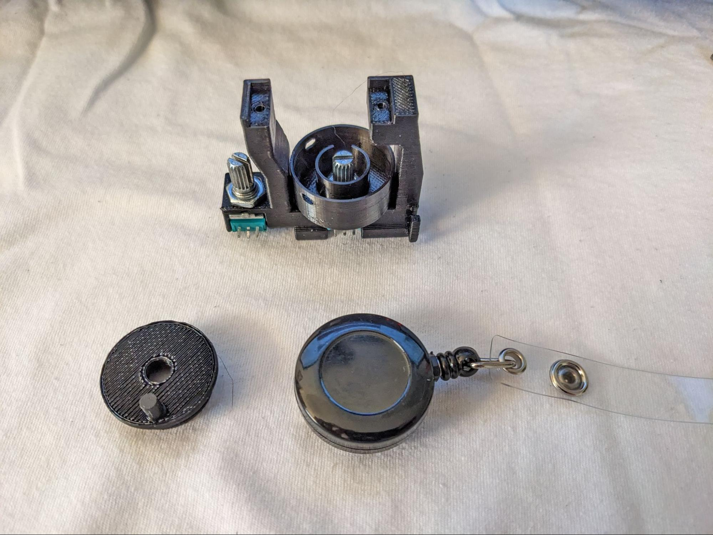

Keep tension as you push the upper spool down onto the potentiometer

>>>>>  gd2md-html alert: inline image link here (to images/image27.jpg). Store image on your image server and adjust path/filename/extension if necessary.  (<a href="#">Back to top</a>)(<a href="#gdcalert29">Next alert</a>) >>>>> 

Insert the other potentiometer, and tighten it into place with the hex nut

>>>>>  gd2md-html alert: inline image link here (to images/image28.jpg). Store image on your image server and adjust path/filename/extension if necessary.  (<a href="#">Back to top</a>)(<a href="#gdcalert30">Next alert</a>) >>>>> 

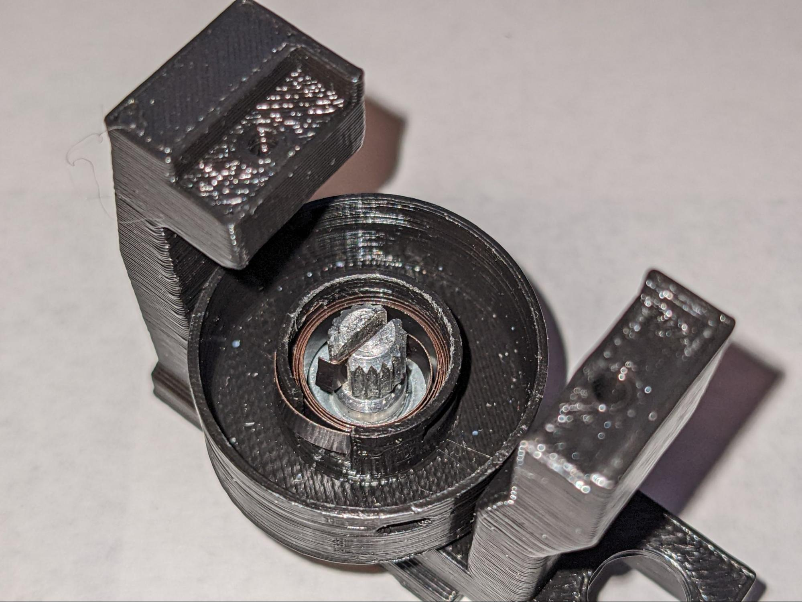

Position the potentiometer shaft so that it is halfway through its rotation range.  Than press the splay linkage onto the potentiometer shaft.

>>>>>  gd2md-html alert: inline image link here (to images/image29.jpg). Store image on your image server and adjust path/filename/extension if necessary.  (<a href="#">Back to top</a>)(<a href="#gdcalert31">Next alert</a>) >>>>> 

Assemble all of the modules in this fashion.

Now on to the larger assembly.

Cut two 12” strips of omni tape for each glove.  May be shorter or longer depending on hand size.

>>>>>  gd2md-html alert: inline image link here (to images/image30.jpg). Store image on your image server and adjust path/filename/extension if necessary.  (<a href="#">Back to top</a>)(<a href="#gdcalert32">Next alert</a>) >>>>> 

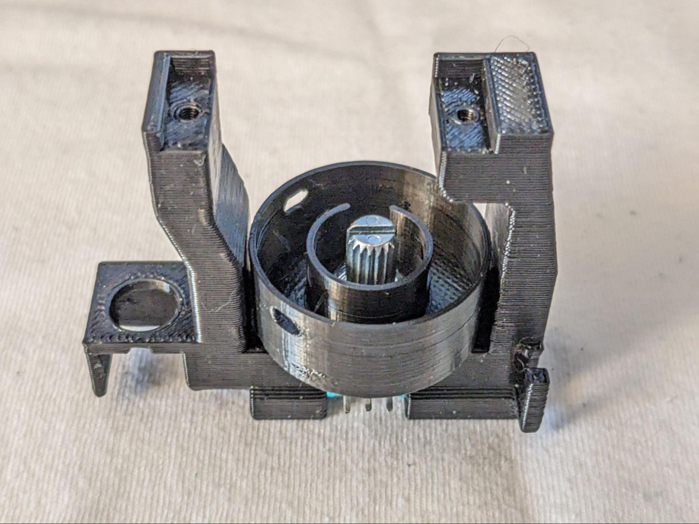

Fasten the straps to the outside edge of the baseplate as shown.  Either sew or glue this end to itself to create a tight anchor point for the straps.

>>>>>  gd2md-html alert: inline image link here (to images/image31.jpg). Store image on your image server and adjust path/filename/extension if necessary.  (<a href="#">Back to top</a>)(<a href="#gdcalert33">Next alert</a>) >>>>> 

Running the straps through the other slots on the baseplate, fasten the baseplate to the glove on your hand.  Find a position that feels comfortable on your hand and where you think the modules will be positioned in line with their respective fingers.  Once you find this potion, use a hot glue gun to glue the baseplate down to the glove in that position.  I prefer to be wearing the glove when I do this, so I can feel and adjust the position as I am gluing.  

>>>>>  gd2md-html alert: inline image link here (to images/image32.jpg). Store image on your image server and adjust path/filename/extension if necessary.  (<a href="#">Back to top</a>)(<a href="#gdcalert34">Next alert</a>) >>>>> 

Once that is dry, put the modules on the baseplate.  They slide on and then the retainers snap into the baseplate to keep them in place.

>>>>>  gd2md-html alert: inline image link here (to images/image33.jpg). Store image on your image server and adjust path/filename/extension if necessary.  (<a href="#">Back to top</a>)(<a href="#gdcalert35">Next alert</a>) >>>>> 

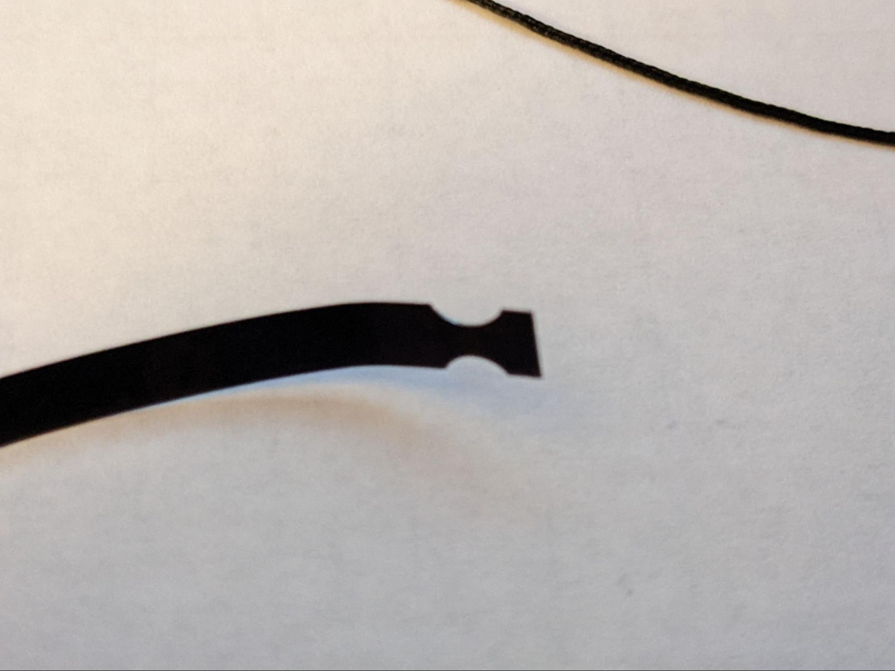

Find a comfortable position for the end of the splay node and glue it to the glove using hot glue.  You should be able to comfortably open/close your hand fully. You should also be able to splay your fingers with the linkage naturally following, this can be trickiest for the thumb.   It should also be generally around the first finger knuckle so it can guide the string at that point.  Do this for every finger.

>>>>>  gd2md-html alert: inline image link here (to images/image34.jpg). Store image on your image server and adjust path/filename/extension if necessary.  (<a href="#">Back to top</a>)(<a href="#gdcalert36">Next alert</a>) >>>>> 

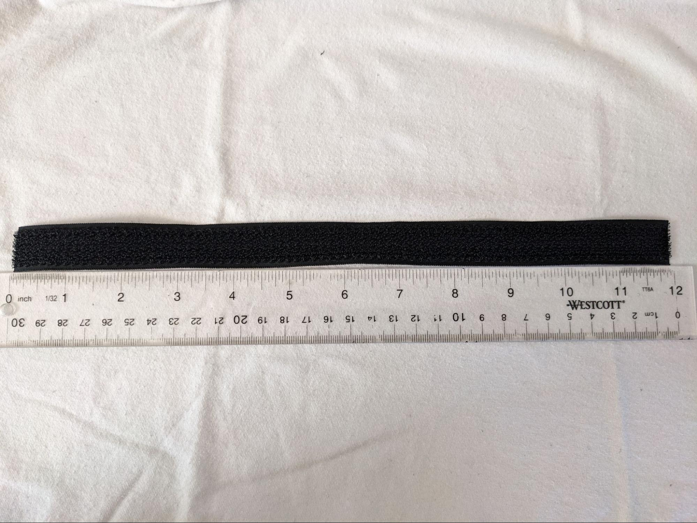

Glue the finger rings onto each finger.  They should be past the last finger knuckle so the wide portion engages with the finger pad.  They shouldn’t be on the center of your finger pad as you still want to be able to feel and use your fingers.  The adjacent finger rings should naturally stagger with the lengths of your fingers, if they are even with each other then they may bump into each other which will be more noticeable when using the final product.

Next use a needle threading tool to thread the string from each module through the two holes on the splay node, and the lower hole on the finger ring.

>>>>>  gd2md-html alert: inline image link here (to images/image35.jpg). Store image on your image server and adjust path/filename/extension if necessary.  (<a href="#">Back to top</a>)(<a href="#gdcalert37">Next alert</a>) >>>>> 

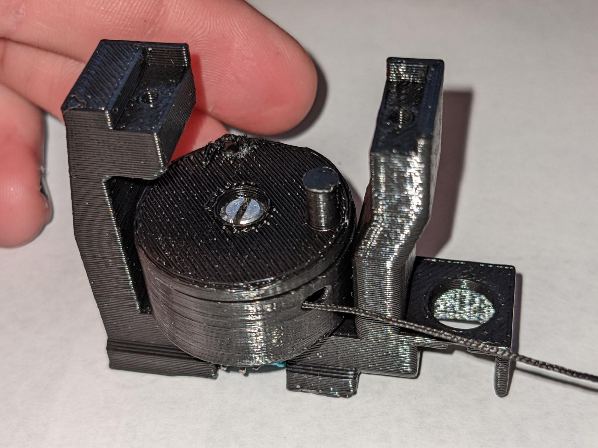

Thread the string back through the top hole of the finger ring.

>>>>>  gd2md-html alert: inline image link here (to images/image36.jpg). Store image on your image server and adjust path/filename/extension if necessary.  (<a href="#">Back to top</a>)(<a href="#gdcalert38">Next alert</a>) >>>>> 

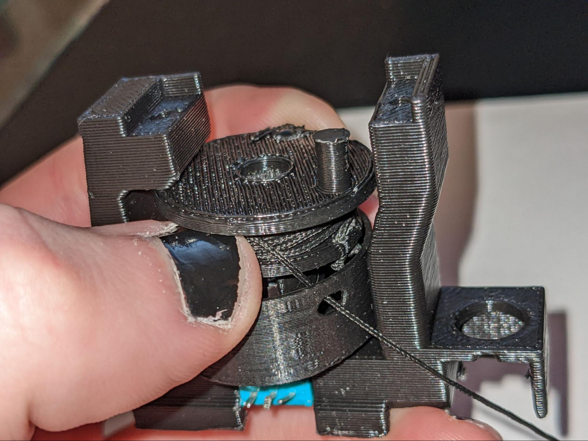

Pull the string taut and tie a double overhand knot at the finger ring.  Start by passing the end of the string under the thread running in between the splay node and finger ring.

>>>>>  gd2md-html alert: inline image link here (to images/image37.jpg). Store image on your image server and adjust path/filename/extension if necessary.  (<a href="#">Back to top</a>)(<a href="#gdcalert39">Next alert</a>) >>>>> 

Pass the end of the string through the loop created by the previous step.  Then pull tight.  Repeat to create a second knot on top.  Before pulling the knot tight, make sure the main line is tight.  The fingers on the glove should be in the  fully extended position, then pull the string coming out of the top hole on the finger ring right before tightening the knot.  This is important so that the string is the right length so that the zero position of the reel is at full extension.  You may need to adjust the tightness in this step.

>>>>>  gd2md-html alert: inline image link here (to images/image38.jpg). Store image on your image server and adjust path/filename/extension if necessary.  (<a href="#">Back to top</a>)(<a href="#gdcalert40">Next alert</a>) >>>>> 

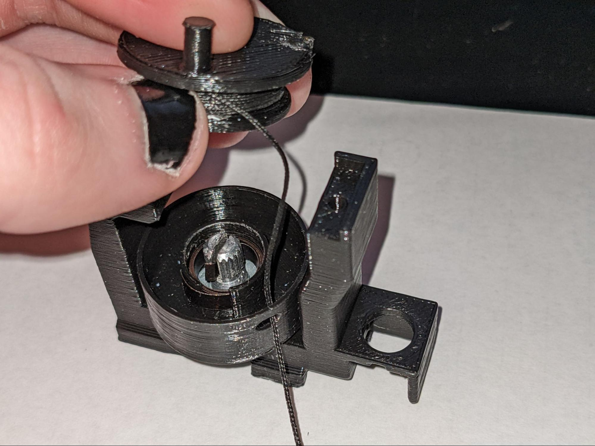

>>>>>  gd2md-html alert: inline image link here (to images/image39.jpg). Store image on your image server and adjust path/filename/extension if necessary.  (<a href="#">Back to top</a>)(<a href="#gdcalert41">Next alert</a>) >>>>> 

